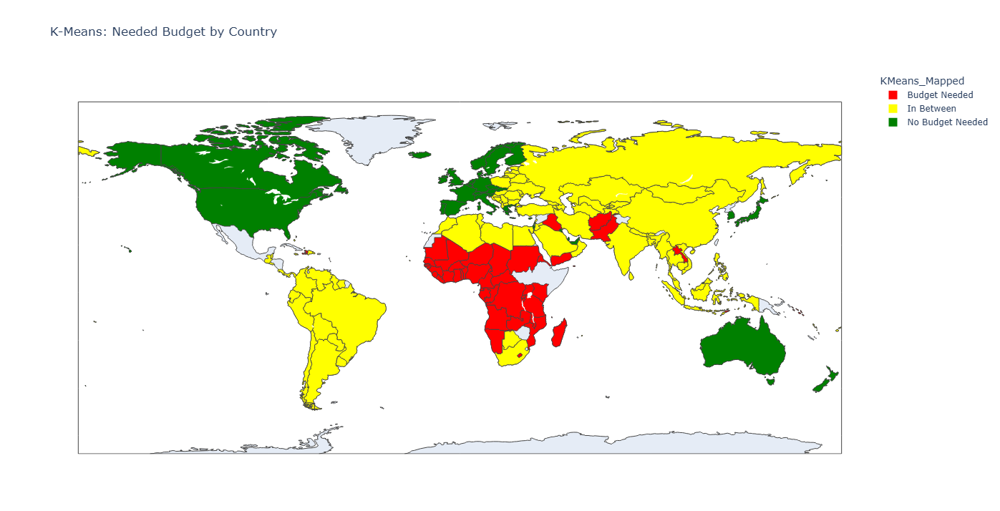

<div align="right">
  <a href="README.md">🇹🇷 Türkçe</a> | <a href="README_EN.md">🇬🇧 English</a>
</div>

# 🌍  Küresel Sosyo-Ekonomik Ülke Segmentasyonu ve Yardım Önceliklendirmesi


## 📌 Proje Özeti
Bu proje, ülkelerin sosyo-ekonomik ve sağlık metriklerini (çocuk ölümleri, gelir düzeyi vb.) analiz ederek, uluslararası yardım bütçelerinin doğru önceliklendirilmesini sağlamak amacıyla geliştirilmiş kapsamlı bir **Denetimsiz Öğrenme (Unsupervised Learning)** çalışmasıdır. 

Veri seti üzerinde **Temel Bileşen Analizi (PCA)** ile boyut indirgeme yapılmış ve ülkeler **K-Means, DBSCAN ve Hiyerarşik Kümeleme** algoritmaları kullanılarak sosyo-ekonomik segmentlere ayrılmıştır.

## 🚀 Temel Özellikler
* **Boyut İndirgeme (Dimensionality Reduction):** Veri setindeki gürültüyü azaltmak ve algoritma performansını artırmak için **PCA** uygulanmıştır.
* **Çoklu Algoritma ile Kümeleme:** K-Means, DBSCAN ve Agglomerative Clustering algoritmaları bağımsız olarak çalıştırılıp karşılaştırılmıştır.
* **Otomatik Hiperparametre Ayarlama:** DBSCAN algoritması için en uygun `eps` ve `min_samples` değerleri Silhouette Skoru baz alınarak otomatik olarak optimize edilmiştir.
* **İnteraktif Coğrafi Analiz:** Kümeleme sonuçları, **Plotly Choropleth** haritaları ile dünya haritası üzerinde görselleştirilmiştir.

## 🛠️ Teknoloji Yığını
* **Veri Manipülasyonu:** `pandas`, `numpy`
* **Makine Öğrenmesi:** `scikit-learn` (MinMaxScaler, PCA, KMeans, DBSCAN, AgglomerativeClustering), `kneed`
* **Veri Görselleştirme:** `seaborn`, `matplotlib`, `plotly.express`

## 🧠 Metodoloji
1. **Veri Ön İşleme (Data Preprocessing):** `MinMaxScaler` kullanılarak verilerin aynı ölçeğe getirilmesi.
2. **PCA:** Varyansın büyük çoğunluğunu açıklayan temel bileşenlerin seçilmesi.
3. **Kümeleme (Clustering):**
   * **K-Means:** `KneeLocator` kütüphanesi ile optimum K değerinin (Elbow Method) matematiksel olarak bulunması.
   * **DBSCAN:** Yoğunluk tabanlı kümeleme ve aykırı değer (outlier) tespiti.
   * **Hierarchical:** Ward linkage ve Euclidean uzaklık metrikleri ile hiyerarşik kümeleme.
4. **İş Mantığı Eşleştirmesi (Business Logic Mapping):** Algoritmaların oluşturduğu kümelerin, ortalama gelir (income) seviyelerine göre "Budget Needed" (Bütçe Gerekli), "In Between" (Arada) ve "No Budget Needed" (Bütçe Gerekmez) şeklinde anlamlı iş etiketlerine dönüştürülmesi.

## 📊 Görselleştirmeler
> **Not:** Kod çalıştırıldığında elde edilen grafik çıktıları aşağıda örneklenmiştir.

### 1. Küme Dağılımları (Cluster Distributions)
 
*Çocuk ölümleri (child_mort) ve gelir seviyesinin (income) kümelere göre istatistiksel dağılımı.*

### 2. Küresel Aksiyon Haritası (Global Action Map)
 
*K-Means sonuçlarına göre dünyadaki finansal yardım öncelik haritası.*

## 💻 Kurulum ve Kullanım

1.  Depoyu klonlayın:
    ```bash
    git clone https://github.com/AdnanSag/socioeconomic-segmentation-ml.git
    ```
2.  Bağımlılıkları yükleyin:
    ```bash
    pip install -r requirements.txt
    ```
---

## 📬 İletişim

Projelerim hakkında konuşmak veya işbirliği yapmak isterseniz bana ulaşabilirsiniz:
* **LinkedIn:** https://www.linkedin.com/in/adnan-sag/ 
* **E-posta:** adnansag91@gmail.com

*Created by Adnan Sag*
